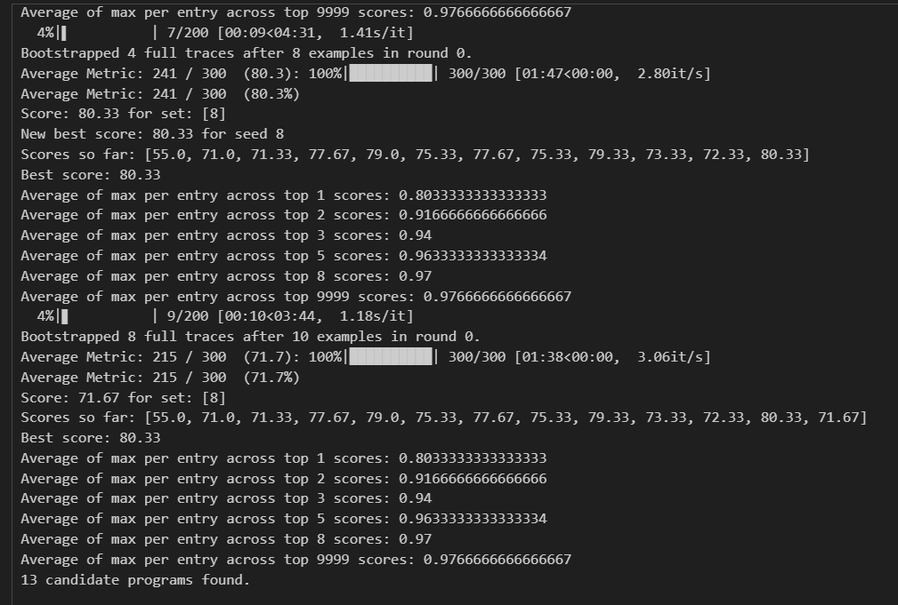
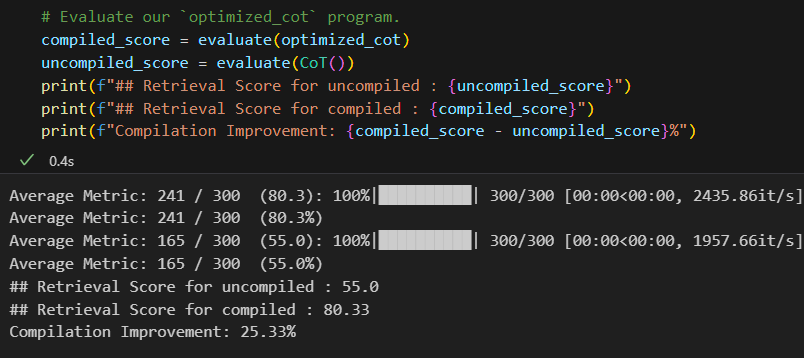

Traditionally, building a complex system with LMs involves a multi-step process that can feel like navigating a labyrinth. Developers must break down the problem into manageable steps, fine-tune prompts and models through trial and error, and constantly adjust to ensure each component interacts seamlessly. This painstaking process is not only time-consuming but also fraught with potential for errors, requiring frequent revisions that can quickly become overwhelming.

In this post we will explore the Demonstrate-Search-Predict (DSP) and the key library for implementing it DSPy in python. DSP is an innovative approach designed to enhance the capabilities of frozen language models (LM) and retrieval models (RM) by enabling them to work in concert to tackle complex, knowledge intensive tasks.  

DSP consists of a number of simple composable functions for implementing in-context learning (ICL)  systems as deliberate programs – instead of end-task prompts—for solving knowledge intensive tasks. DSPy is the current implementation of this ICL Compiler  

## Introducing DSPy:
At its core, DSPy revolutionizes this process by separating the flow of your program (modules) from the parameters (LM prompts and weights) of each step. It introduces a suite of new optimizers—LM-driven algorithms capable of tuning prompts and weights to maximize a given metric. This means DSPy can teach powerful models like GPT-3.5 or GPT-4, as well as local models like T5-base or Llama2-13b, to perform tasks with unprecedented reliability and quality.

The DSP methodology is structured into three distinct phases: Demonstrate, Search, and Predict. Each phase plays a critical role in guiding LMs to understand and respond to complex queries with a depth of knowledge and reasoning that was previously unattainable without extensive retraining. 

- Demonstrate: This initial phase leverages the power of in-context learning, priming the LM with examples that illustrate the task's desired outcome. It's about setting the stage, providing the LM with a clear understanding of what is expected, which in turn enables it to generate relevant queries for the RM. 

- Search: At this juncture, the RM takes the baton, diving into vast data repositories to fetch information that responds to the LM's queries. The DSP framework's elegance lies in its ability to perform multi-hop searches—each search informed by the last—mimicking the iterative, deep-diving nature of human inquiry. 

- Predict: With the necessary information in hand, the LM then crafts a comprehensive response. Here, the DSP framework shines by encouraging the LM to articulate a Chain of Thought (CoT), offering not just answers but the rationale behind them, fostering transparency and trust in AI-generated content. 

DSPy's approach to system development mirrors the evolution in neural network design, where manual adjustments of parameters gave way to the use of frameworks like PyTorch for automatic optimization. In a similar vein, DSPy replaces the need for prompt hacking and synthetic data generation with general-purpose modules and optimizers. These automate the tuning process and help adapt to changes in models,code, data, and objectives, ensuring that your system remains efficient and effective over time.

## Practical Applications: DSPy in Action
In this example, we'll explore how DSPy can be used to enhance the process of solving math questions from the GSM8K dataset. This dataset is a collection of grade school math problems, which presents a unique challenge for language models: not only understanding the text of the question but also performing the necessary calculations to arrive at the correct answer.

### Traditional Approach Challenges:
- Crafting prompts that guide the language model to understand and solve math problems can be highly nuanced.
- Ensuring the language model consistently follows logical steps toward the correct answer requires careful prompt engineering and potentially extensive fine-tuning.

### Step 1: Setting Up the Language Model
First, we configure DSPy to use a specific version of the GPT model optimized for instructions, ensuring our language model is primed for detailed, instruction-following tasks.

```python import dspy

# Set up the LM with GPT-3.5-turbo-instruct for detailed instruction following
turbo = dspy.OpenAI(model='gpt-3.5-turbo-instruct', max_tokens=250)
dspy.settings.configure(lm=turbo)
```

### Step 2: Loading the Dataset
We then load the GSM8K dataset, which contains the math questions we want our model to solve.

```python
from dspy.datasets.gsm8k import GSM8K

# Load math questions from the GSM8K dataset
gms8k = GSM8K()
trainset, devset = gms8k.train, gms8k.dev

```

Finally, we compile our DSPy module using optimizers that automatically adjust prompts and weights to maximize the outcome metrics such as accuracy and coherence.

### Step 3: Creating the DSPy Module for Chain of Thought (CoT)
The Chain of Thought (CoT) approach involves the model generating intermediate steps leading to the final answer, mimicking how a human might solve a math problem.

```python
class CoT(dspy.Module):
    def __init__(self):
        super().__init__()
        self.prog = dspy.ChainOfThought("question -> answer")
    
    def forward(self, question):
        answer = self.prog(question=question)
        return answer 
```

### Step 4: Optimizing with DSPy's Teleprompt
We employ DSPy's BootstrapFewShotWithRandomSearch optimizer to refine our CoT module. This optimizer self-generates examples and iteratively improves the model's performance on our dataset.

```python
from dspy.teleprompt import BootstrapFewShotWithRandomSearch

config = dict(max_bootstrapped_demos=8, max_labeled_demos=8, num_candidate_programs=10, num_threads=4)

teleprompter = BootstrapFewShotWithRandomSearch(metric=gsm8k_metric, **config)
optimized_cot = teleprompter.compile(CoT(), trainset=trainset, valset=devset)
```

This step is where the magic happens. The optimizer automatically adjusts the prompts and weights of our CoT module to maximize the desired outcome metrics, such as accuracy and coherence. This automation significantly reduces the need for manual fine-tuning and prompt crafting, streamlining the development process.

### Step 5: Evaluating the Optimized Model
Finally, we evaluate our optimized CoT module on the development set to measure its effectiveness in solving math problems.

```python
from dspy.evaluate import Evaluate

evaluate = Evaluate(devset=devset, metric=gsm8k_metric, num_threads=4, display_progress=True)
compiled_score = evaluate(optimized_cot)
uncompiled_score = evaluate(CoT())

```
This evaluation step allows us to compare the performance of our optimized CoT module with the unoptimized version, providing valuable insights into the effectiveness of our optimization process. The results? 



**A 25.33% improvement in accuracy.**

DSPy not only simplifies the current process of developing complex systems with LMs but also opens up new possibilities for innovation. By reducing the dependency on manual prompt crafting and fine-tuning, developers can focus more on the creative and strategic aspects of their projects. This shift has the potential to accelerate the development of more sophisticated and versatile systems, pushing the boundaries of what's possible with language models.

DSPy represents a significant leap forward in the field of complex system development with language models. Its ability to automate and optimize the use of language models within these systems promises not only to streamline the development process but also to enhance the robustness and scalability of the solutions created. As we look to the future, it's clear to us that frameworks and techniques like DSPy will play a pivotal role.


### Interested in learning more about the project? 
Check out Stanford's [DSPy GitHub repository](https://github.com/stanfordnlp/dspy/tree/main) or the [DSPy documentation](https://dspy-docs.vercel.app/)! 

